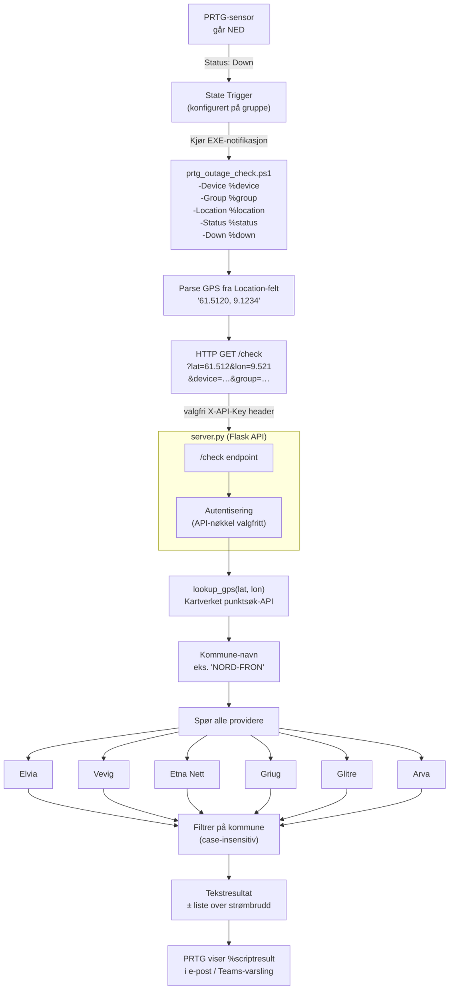
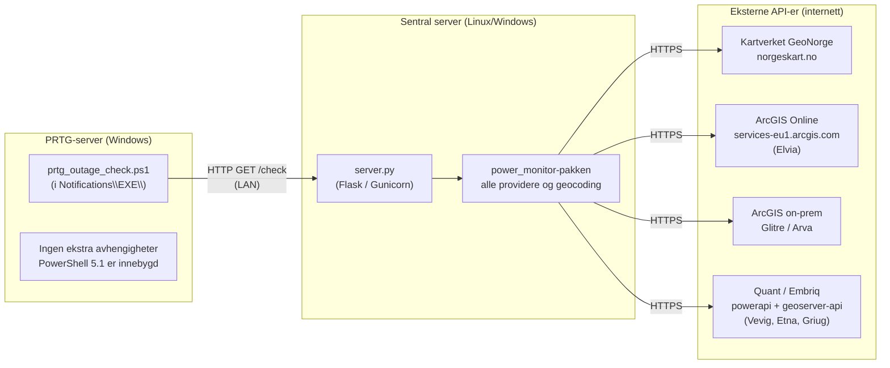
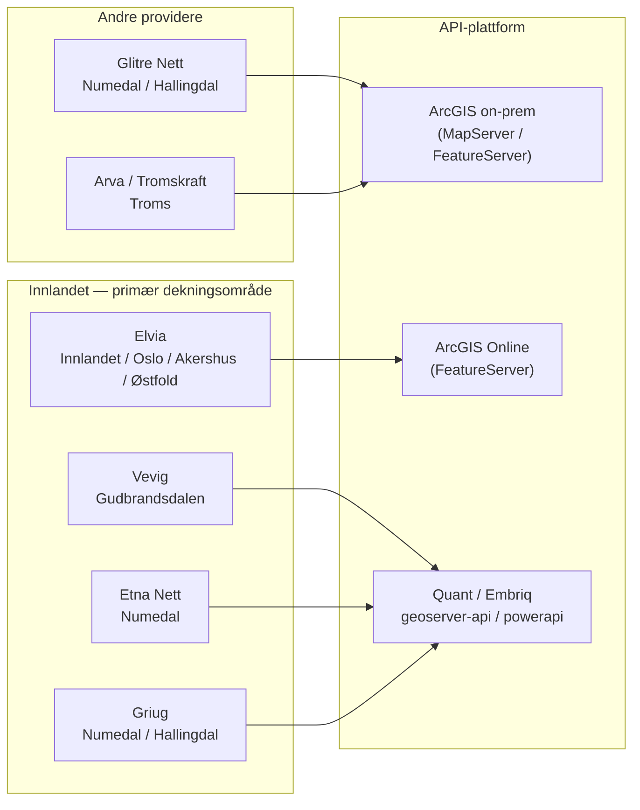

# Power Monitor — Systemdesign

## 1. Flyt: fra PRTG-alarm til svar



---

## 2. Deployment



---

## 3. Provider-oversikt



---

## 4. CLI-kommandoer

```
python -m power_monitor check 2615
    └─ Slår opp postnummer → kommune → spør Innlandet-providere

python -m power_monitor check "Storgata 1, Lillehammer"
    └─ Slår opp adresse → kommune → spør Innlandet-providere

python -m power_monitor check 2615 --all-providers
    └─ Samme, men spør alle 6 providere

python -m power_monitor list [--provider elvia|vevig|etna|griug|glitre|arva|innlandet|all]
    └─ Lister alle aktive strømbrudd fra valgt provider

python -m power_monitor planned [--provider ...]
    └─ Lister planlagte koblinger som ikke har startet ennå

python -m power_monitor providers
    └─ Viser status og antall endepunkter per provider
```

---

## 5. PRTG-konfigurasjon (oppsummering)

```
1. Kopier prtg_outage_check.ps1 til:
   C:\Program Files (x86)\PRTG Network Monitor\Notifications\EXE\

2. Sett $ApiUrl i toppen av filen.

3. PRTG → Setup → Notifications → Add Notification
   Type: Execute Program
   Program: prtg_outage_check.ps1
   Parameters:
     -Device "%device" -Group "%group" -Sensor "%name"
     -Status "%status" -Location "%location" -Down "%down"

4. PRTG → Gruppe → Notifications → Add State Trigger
   When: Down  →  Execute: Power Outage Check

5. Legg til %scriptresult i varslings-malen (e-post / Teams).

6. Sett Location-feltet på hver gruppe til GPS-koordinater:
   "61.5120, 9.1234"
```
